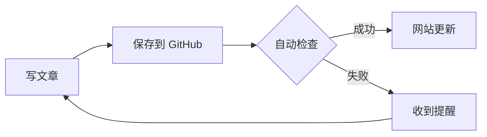

这篇示例文章展示了技术类文章会用到的几种排版能力：代码高亮、数学公式、流程图。

<!-- more -->

## 代码块

写代码时，用三个反引号把代码围起来，并在开头写上语言名字（比如 `python`），网站就会自动给代码上色：

```python
def fibonacci(n: int) -> list[int]:
    """生成前 n 个斐波那契数"""
    seq = [0, 1]
    while len(seq) < n:
        seq.append(seq[-1] + seq[-2])
    return seq[:n]


if __name__ == "__main__":
    print(fibonacci(10))
```

代码块右上角有一个复制按钮，方便读者直接取用。

## 数学公式

行内公式写在一对美元符号里，例如质能方程 $E = mc^2$，又比如圆的面积 $S = \pi r^2$。

独立成行的公式写成两对美元符号：

$$
\int_{-\infty}^{\infty} e^{-x^2} \, dx = \sqrt{\pi}
$$

$$
f(x) = \sum_{i=1}^{n} \frac{x_i}{\sqrt{1 + x_i^2}}
$$

> 注意：写公式的文章，需要在文章开头的设置区（front-matter）加上一行 `mathjax: true`。

## 流程图

用 `mermaid` 代码块可以画流程图、时序图、甘特图等：



## 提示框

主题提供了几种提示框，用来强调内容：


用来补充说明某些内容。



用来提醒容易出错的地方。



用来标注推荐做法或正确结果。


## 表格

| 功能 | 状态 | 说明 |
|---|---|---|
| 代码高亮 | ✅ | 支持 100 多种编程语言 |
| 数学公式 | ✅ | 行内、整行都可以 |
| 流程图 | ✅ | 也支持时序图、甘特图 |
| 提示框 | ✅ | 提示、警告、成功、失败四种 |

---

以上这些能力，写生活随笔时大多用不到，但写技术笔记时很方便。用不到的部分忽略就好。
